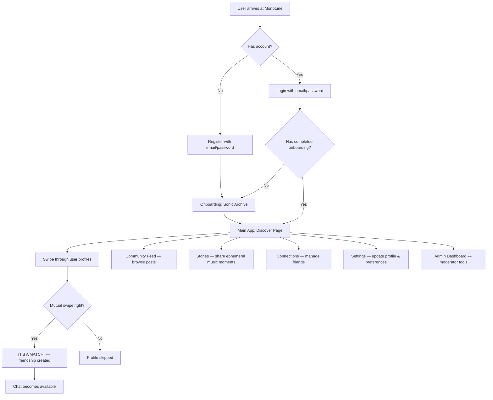
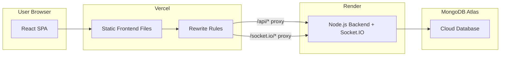

# Monotune — Complete Project Overview

> **A safe, minimalist social network for music lovers featuring sonic similarity matching and AI-powered content moderation.**

---

## 1. What Is Monotune?

Monotune is a **music-first social network** where people connect based on their actual music taste rather than random friend requests. Think of it like a mashup of **Tinder** (swipe-based discovery) + **Reddit** (community feed with threaded posts) + **Instagram Stories** (ephemeral music-sharing stories) — but where everything revolves around your music identity.

### The Core Idea
Every user creates a "Sonic Identity" — their top 5 artists, a favorite genre, and a "Sonic Anthem" (a single song that defines them). The app then uses a **mathematical similarity algorithm** (Jaccard index) to calculate a **compatibility percentage** between any two users. You discover people by swiping through profiles ranked by how closely your music tastes overlap.

### Why "Monotune"?
The name reflects the app's minimalist, monochromatic brutalist design aesthetic — everything is black, white, and grey with sharp borders and bold typography. The UI looks like a mix between a command-line terminal and a high-fashion editorial magazine.

---

## 2. Tech Stack — Complete Breakdown

### Architecture Type
**Monorepo** — frontend and backend live in the same Git repository, managed by **npm workspaces**.

```
monotune/
├── frontend/    ← React SPA (Single Page Application)
├── backend/     ← Express.js REST API server
└── package.json ← Root workspace config
```

---

### Frontend Stack

| Technology | Version | Purpose |
|---|---|---|
| **React** | 19.0.0 | UI component library |
| **TypeScript** | ~5.8.2 | Type-safe JavaScript |
| **Vite** | 6.2.0 | Dev server & build tool (replaces Webpack) |
| **Tailwind CSS** | 4.1.14 | Utility-first CSS framework (v4 with `@theme` syntax) |
| **React Router DOM** | 7.14.2 | Client-side page routing (SPA navigation) |
| **Motion** (Framer Motion) | 12.23.24 | Animations (swipe cards, transitions, story effects) |
| **Lucide React** | 0.546.0 | Icon library (all icons you see in the UI) |
| **Socket.IO Client** | 4.8.3 | Real-time WebSocket connection for live chat |
| **clsx** / **tailwind-merge** | Latest | Utility for conditional CSS class merging |

#### How It Works
- Vite serves the frontend on `http://localhost:5173` during development
- Vite's **dev proxy** forwards any `/api/*` requests to the backend at `http://localhost:3000`
- The app is a **Single Page Application (SPA)** — React Router handles all navigation client-side without full page reloads
- In production, Vite builds static HTML/CSS/JS files that are deployed to **Vercel**

---

### Backend Stack

| Technology | Version | Purpose |
|---|---|---|
| **Express.js** | 4.21.2 | HTTP server framework (handles all API endpoints) |
| **TypeScript** | ~5.8.2 | Type-safe server code |
| **tsx** | 4.21.0 | TypeScript runner (no compile step — runs `.ts` files directly) |
| **MongoDB** | — | NoSQL database (document-based) |
| **Mongoose** | 8.14.1 | MongoDB object modeling (schemas, validation, queries) |
| **JWT (jsonwebtoken)** | 9.0.3 | Authentication tokens (stateless auth) |
| **bcryptjs** | 3.0.3 | Password hashing (one-way encryption) |
| **Socket.IO** | 4.8.3 | Real-time WebSocket server for live chat |
| **Multer** | 2.1.1 | File upload middleware (image uploads) |
| **express-rate-limit** | 8.5.1 | API rate limiting (prevents abuse) |
| **dotenv** | 17.2.3 | Environment variable loading from `.env` files |
| **cors** | 2.8.6 | Cross-Origin Resource Sharing (allows frontend to call backend) |

#### How It Works
- Express listens on port `3000` and serves a REST API under `/api/*`
- MongoDB stores all application data (users, posts, messages, etc.)
- All protected routes require a **JWT Bearer token** in the `Authorization` header
- Socket.IO runs alongside Express on the same HTTP server for real-time messaging
- A **single server.ts file** (~1400 lines) contains all routes and logic

---

### Database: MongoDB

MongoDB is a **document database** — instead of tables with rows (like SQL), it stores data as **JSON-like documents** in **collections**.

**Why MongoDB for this project?**
- Flexible schema — easy to add new fields without migrations
- Good for MVPs — fast iteration without rigid schema constraints
- Works well with JavaScript/TypeScript through Mongoose
- Free tier on MongoDB Atlas for production hosting

---

### External Integrations

| Service | Purpose |
|---|---|
| **Spotify Web API** | Artist search, track search, OAuth login for syncing top artists |
| **Toxicity AI Service** | External ML model that classifies text as toxic or safe (optional; fails open) |
| **DiceBear** | Auto-generated avatar images for users without profile pictures |

---

## 3. How the App Works — User Flow



### Step-by-Step Breakdown

1. **Registration** → Creates user account, hashes password with bcrypt, generates a verification token, issues a JWT
2. **Onboarding ("Sonic Archive")** → User fills in their top 5 artists (can search Spotify or type manually), picks a favorite genre, selects a "Sonic Anthem" track, and writes a bio ("Liner Notes")
3. **Discovery** → Algorithm fetches all users, calculates similarity scores, ranks them, and presents them as swipeable cards
4. **Swiping** → Right swipe = interested, Left swipe = skip. If both users swipe right on each other → **it's a match** (friendship created)
5. **Chat** → Matched users can send text messages and Spotify tracks in real-time via WebSockets
6. **Feed** → Reddit-like community board where anyone can post with text, images, and Spotify embeds
7. **Stories** → Temporary (24-hour) posts visible only to friends, featuring a Spotify track and custom background color

---

## 4. Deployment Architecture



### Platform Roles

| Platform | What It Hosts | Cost |
|---|---|---|
| **Vercel** | Frontend (React SPA) — serves static HTML/CSS/JS + proxies API calls | Free tier |
| **Render** | Backend (Express + Socket.IO server) — handles all API logic | Free tier |
| **MongoDB Atlas** | Cloud-hosted MongoDB database | Free tier (512MB) |

### How the Proxy Works
When the frontend is deployed on Vercel and the backend is on Render, they're on **different domains**. The `vercel.json` file contains **rewrite rules** that proxy:
- `/api/*` → `https://monotune-api.onrender.com/api/*`
- `/socket.io/*` → `https://monotune-api.onrender.com/socket.io/*`

This makes the frontend think the API is on the same domain, avoiding CORS issues.

### Environment Variables Required

**Backend (Render):**
```
MONGODB_URI          → MongoDB Atlas connection string
JWT_SECRET           → Secret key for signing JWT tokens
PORT                 → 3000
SPOTIFY_CLIENT_ID    → From Spotify Developer Dashboard
SPOTIFY_CLIENT_SECRET → From Spotify Developer Dashboard
SPOTIFY_REDIRECT_URI → https://monotune-api.onrender.com/api/auth/spotify/callback
FRONTEND_URL         → https://monotune.vercel.app (or your Vercel domain)
```

**Frontend (Vercel):**
```
VITE_API_URL         → https://monotune-api.onrender.com
```

---

## 5. Feature Breakdown

### 5.1 Authentication & Security
- **JWT-based stateless auth** — no server-side sessions
- **bcrypt password hashing** — passwords are never stored in plain text
- **Email verification** — token-based (currently logs URL to console; needs real email service)
- **Ban check middleware** — every authenticated request verifies the user isn't banned
- **Rate limiting** — auth routes: 10/15min, general API: 100/min, uploads: 10/min

### 5.2 Discovery Engine (Tinder-like Matching)
- **Jaccard similarity algorithm** — compares top 5 artists between two users using set intersection/union
- **Swipeable card UI** — drag-to-swipe with spring physics animations (Framer Motion)
- **Genre filtering** — filter discovery feed by genre
- **Minimum threshold setting** — users can set a minimum match percentage to only see highly compatible profiles
- **Encore system** — 1 "super-like" per day (limited resource that signals extra interest)
- **Mutual match detection** — when both users swipe right, a "match" is created and both are notified

### 5.3 Community Feed (Reddit-like Forum)
- **Create posts** with title, text content, attached images, and embedded Spotify tracks
- **Upvote/downvote system** — community-driven content ranking
- **Threaded comments** — each post has its own comment thread
- **AI toxicity moderation** — posts and comments are screened before publishing
- **Pagination** — 20 posts per page with "Load More" button
- **Image attachments** — uploaded via Multer, stored as binary data in MongoDB

### 5.4 Real-Time Chat (WhatsApp-like Messaging)
- **WebSocket-powered** via Socket.IO — messages appear instantly without polling
- **Text messages** — standard chat
- **Song reactions** — share Spotify tracks as rich media messages with embedded player
- **Read receipts** — double-check marks when the recipient reads the message
- **Inbox with request tab** — separates friend chats from new incoming message requests
- **Paginated message history** — loads 50 messages at a time with "Load Earlier" button

### 5.5 Stories (Instagram-like Ephemeral Content)
- **24-hour expiring content** — stories auto-delete after 1 day
- **Spotify track attachment** — share a song as your story
- **Custom background color** — pick a vibe color for your story
- **Image upload support** — attach photos to stories
- **Auto-advance playback** — 5-second timer per story with progress bar animation
- **Friend-only visibility** — only your friends can see your stories

### 5.6 User Profiles
- **Sonic Fingerprint** — displays top 5 artists in a stylized list
- **Sonic Anthem** — featured song with embedded Spotify player (auto-plays)
- **Compatibility score** — dynamically calculated when viewing another user's profile
- **Friendship management** — add friend, accept/reject request, unfriend
- **Direct message link** — one-click to start a chat
- **Broadcast archive** — all posts by the user displayed in a grid
- **Visual showcase** — up to 3 profile showcase images
- **Profile picture** — upload/remove with drag-and-drop support

### 5.7 Connections Hub (Network Manager)
- **Active connections** — searchable list of all friends with similarity scores
- **Incoming signals** — pending friend requests with accept/reject actions
- **Unfriend and block** — relationship management with confirmation modals
- **Block list** — view and unblock previously blocked users

### 5.8 Admin Dashboard
- **Platform statistics** — total users, total posts, flagged content count
- **Manual review queue** — borderline content (has toxicity score > 0 but not flagged) for human review
- **Ban users** — admins can ban any user, which blocks them from all API access
- **Protected routes** — admin endpoints require both `requireAuth` and `requireAdmin` middleware

### 5.9 Settings
- **Edit email and password** — with bcrypt re-hashing
- **Update sonic identity** — change top 5 artists, genre, anthem, bio
- **Spotify sync** — connect/disconnect Spotify account, auto-import top artists
- **Profile picture upload** — with drag-and-drop zone
- **Profile showcase images** — manage up to 3 images
- **Discovery threshold slider** — control minimum match percentage
- **Account deletion** — full cascade delete with triple confirmation prompt

### 5.10 Notification System
- **Badge counters** — unread message count and pending connection count shown in nav bar
- **5-second polling** — notification counts refresh every 5 seconds

---

## 6. What Makes Monotune Different / Better?

| Feature | Typical Social Networks | Monotune |
|---|---|---|
| **Connection basis** | Random follows, mutual friends | Algorithmic music taste matching |
| **Content moderation** | Reactive (report → review) | Proactive AI screening before publishing |
| **Discovery** | Suggested by engagement metrics | Swiping based on real compatibility % |
| **Music integration** | External links only | Deep Spotify integration throughout (posts, chat, stories, profiles) |
| **Design philosophy** | Generic Material/iOS patterns | Distinctive brutalist aesthetic that stands out |
| **Privacy by default** | Public profiles | Stories only visible to friends; DMs only after matching |

---

## 7. Why Is This an MVP?

> [!IMPORTANT]
> **MVP = Minimum Viable Product** — the smallest version of the product that demonstrates the core concept and can be tested with real users.

### What Makes It an MVP ✅
- ✅ Core matching algorithm works end-to-end
- ✅ Full user lifecycle (register → onboard → discover → connect → chat)
- ✅ Real-time messaging with WebSockets
- ✅ Content creation and community interaction
- ✅ AI moderation pipeline (with fail-open safety)
- ✅ Admin controls for moderation
- ✅ Spotify integration for music search
- ✅ Responsive design for mobile and desktop
- ✅ Deployment-ready with Vercel + Render

### What's NOT Production-Ready ⚠️
- ⚠️ Images stored in MongoDB binary (not scalable — should use S3/Cloudinary)
- ⚠️ Email verification only logs to console (no real email delivery)
- ⚠️ Single-file server architecture (1400 lines — not maintainable long-term)
- ⚠️ No automated test suite
- ⚠️ JWT tokens never expire (no refresh token flow)
- ⚠️ Toxicity API is optional and fails open (all content allowed if down)
- ⚠️ No push notifications
- ⚠️ No password reset flow

---

## 8. What's Missing — Future Roadmap

### 🔴 Critical (Must-Have for Production)

| Feature | Why It Matters |
|---|---|
| **Real email service** (SendGrid/Resend) | Users can't verify their accounts without it |
| **JWT expiry + refresh tokens** | Current tokens live forever — security risk |
| **Image storage migration** (S3/Cloudinary) | MongoDB binary storage doesn't scale; costs grow fast |
| **Password reset flow** | Users locked out permanently if they forget passwords |
| **Test suite** (Jest/Vitest) | No way to catch regressions; risky deployments |
| **Server file splitting** | 1400-line monolith is unmaintainable; needs route separation |
| **HTTPS everywhere** | Cookie security, data encryption in transit |

### 🟡 Important (Should Have Soon)

| Feature | Description |
|---|---|
| **Push notifications** | Web push (Service Workers) or mobile push for new messages/matches |
| **Read-time song preview** | Play 30-second Spotify previews directly in the card UI |
| **Typing indicators** | Real typing events via WebSocket (currently mocked) |
| **User search** | Search users by username globally |
| **Report system** | Users should be able to report content/users, not just admins |
| **Comment pagination** | Currently loads all comments at once |
| **Post editing** | Users can't edit posts after publishing |
| **Notification history** | Persistent notification log (not just badge counts) |

### 🟢 Nice to Have (Future Enhancement)

| Feature | Description |
|---|---|
| **Playlist sharing** | Share full Spotify playlists in posts/chat |
| **Group chats** | Multi-user chat rooms (currently 1:1 only) |
| **Music taste timeline** | Track how your artists change over time |
| **Event discovery** | Find concerts/events near you based on your artists |
| **Dark mode** | The brutalist theme is already dark-adjacent, but a full dark mode would be nice |
| **Progressive Web App** | Offline support, installable on mobile home screen |
| **Spotify listening activity** | Show what you're currently playing |
| **Recommendation engine** | ML-based artist recommendations based on your network |
| **OAuth providers** | Login with Google/Apple in addition to email |
| **Profile analytics** | See who viewed your profile, match stats |

---

## 9. Local Development Setup

### Prerequisites
- **Node.js** (v20.x recommended)
- **MongoDB** (local or Docker)

### Steps

```bash
# 1. Clone the repository
git clone <repo-url>
cd monotune

# 2. Install all dependencies (both frontend and backend)
npm install

# 3. Copy environment config
cp backend/.env.example backend/.env

# 4. Start MongoDB (if using Docker)
docker run -d -p 27017:27017 --name mongodb mongo:latest

# 5. Seed the database with test data
npm run seed

# 6. Start both servers simultaneously
npm run dev
```

**Frontend:** http://localhost:5173  
**Backend API:** http://localhost:3000

### Test Accounts
| Email | Password |
|---|---|
| alice@example.com | password123 |
| bob@example.com | password123 |
| charlie@example.com | password123 |
| diana@example.com | password123 |

---

## 10. Rate Limiting

| Route Category | Limit | Window |
|---|---|---|
| Auth routes (`/api/auth/*`) | 10 requests | 15 minutes |
| General API (`/api/*`) | 100 requests | 1 minute |
| Upload routes (`/api/upload`) | 10 uploads | 1 minute |

---

## 11. Security Measures Implemented

1. **Password hashing** — bcrypt with 10 salt rounds
2. **JWT authentication** — required on all protected routes
3. **Ban enforcement** — checked at middleware level (every request)
4. **Admin verification** — separate `requireAdmin` middleware
5. **File upload validation** — 5MB limit, MIME type checking for profile pictures
6. **Rate limiting** — per-IP rate limits on auth, general, and upload routes
7. **CORS** — configured for cross-origin requests
8. **Input sanitization** — Mongoose schema validation
9. **AI content moderation** — pre-publish toxicity screening
10. **Cascade deletion** — full data cleanup when accounts are deleted
11. **Block system** — blocked users can't discover or interact with each other
12. **Ban interception** — frontend intercepts 403 "Account banned" responses globally
